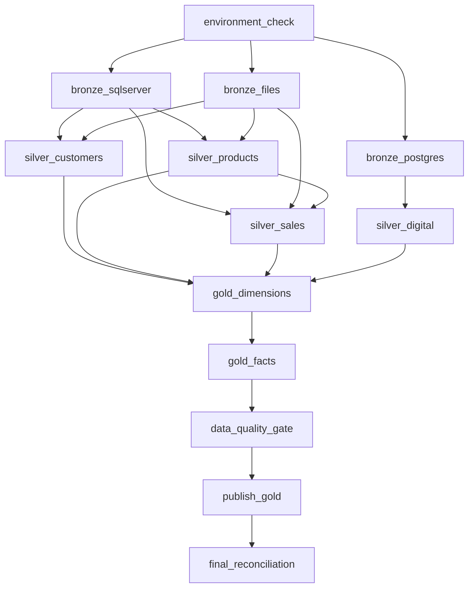

# Lakeflow Jobs task map

The quality gate is intentionally between Gold construction and publication. A failed required check must prevent publication. In Databricks Free Edition, compute and concurrency are quota-limited; this graph uses at most three parallel Bronze tasks and four parallel prerequisites for Gold dimensions, below the documented five-task concurrent Jobs limit as accessed on 2026-08-16.
