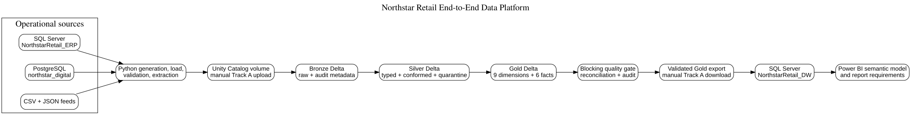
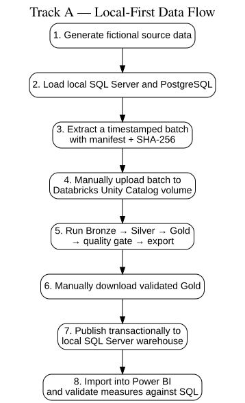
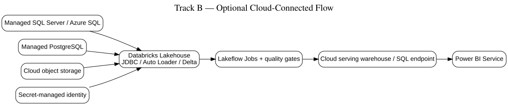
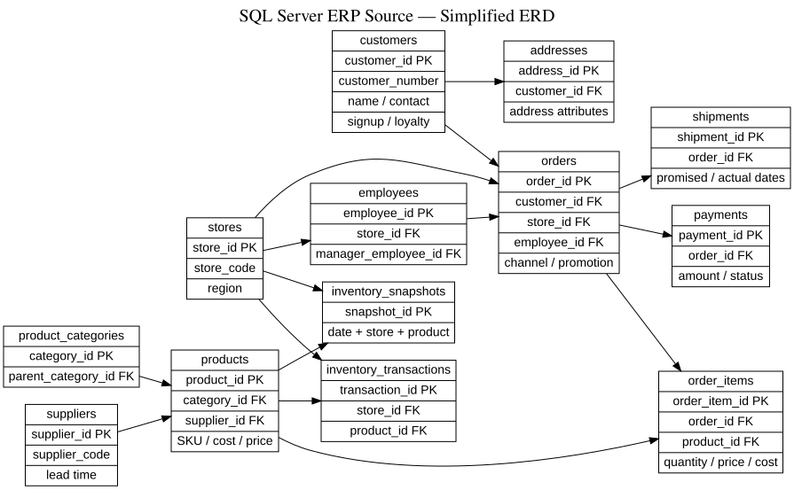
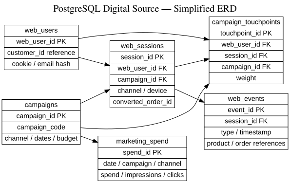
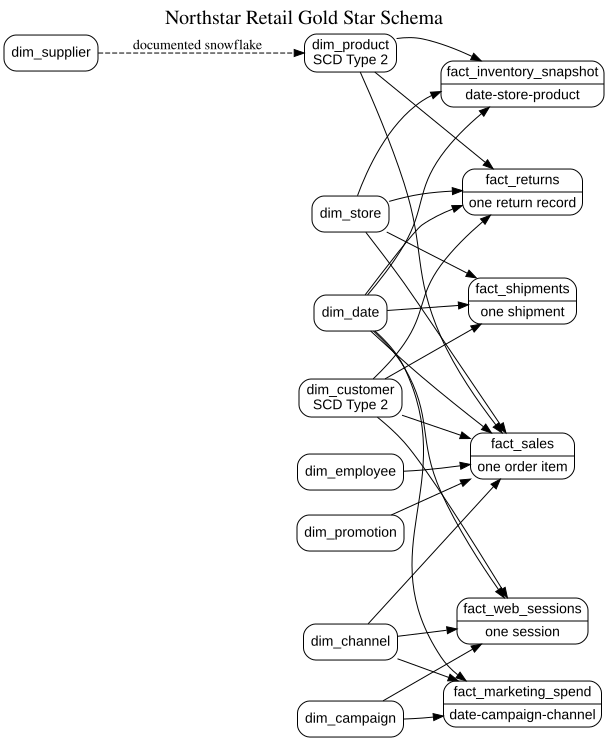
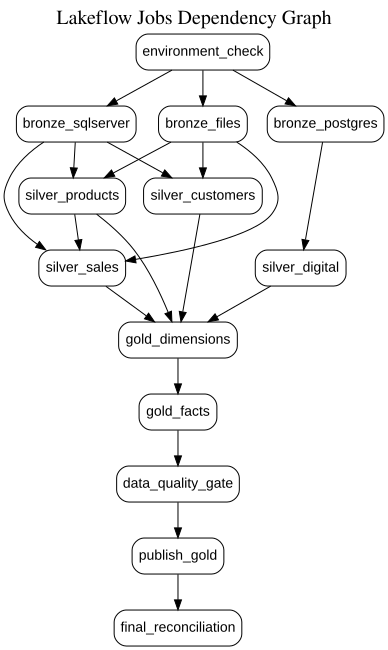
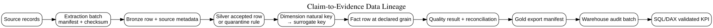
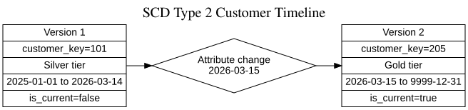

# Architecture

## Child-simple explanation

Northstar Retail has information in three places: a store-and-order database, a website database, and files. A Python helper makes fictional practice data and later copies data out of the local databases. You manually place one sealed batch folder in Databricks because a cloud Databricks workspace cannot magically reach a database on your own computer. Databricks stores the original copy in Bronze, cleans it in Silver, and organizes it for reporting in Gold. After tests pass, you download Gold files and load them into a local SQL Server warehouse. Power BI reads that warehouse and shows definitions everyone can share.

## Professional interview explanation

The default implementation is a batch ELT lakehouse pattern with three heterogeneous sources, deterministic synthetic fixtures, manifest-driven file handoff, Delta medallion layers, orchestrated validation gates, a dimensional Gold model, a mirrored SQL Server serving warehouse, and a Power BI semantic model. Track A intentionally uses manual upload/download boundaries to avoid false claims about private-network connectivity. Batch IDs, checksums, audit metadata, quarantine tables, effective-date joins, and idempotent replacement/merge patterns support traceability and safe reruns.

## Track A — local-first data flow

Manual steps are honest parts of this learning track:

1. Upload the local extraction batch to a Unity Catalog volume.
2. Start the Lakeflow Job with that exact batch ID.
3. Download the validated Gold export.
4. Run the local SQL Server publication loader.
5. Refresh the imported Power BI model.

## Track B — optional cloud-connected flow

Track B replaces manual boundaries with network-accessible managed databases and cloud object storage. It requires real firewall/private networking decisions, supported JDBC drivers, secret management, least-privilege identities, and cost monitoring. It is not required to complete the beginner project.

## Layer contract

| Layer | Contract | Allowed changes | Rerun behavior |
|---|---|---|---|
| Bronze | Raw values plus source/batch/file/hash metadata | Parsing only enough to read; no business correction | Delete and replace same batch, or merge on batch/hash |
| Silver | Typed, standardized, deduplicated, conformed, valid and quarantined | Business-quality rules are explicit and tested | Batch replacement or Delta MERGE on business key/change hash |
| Gold | Dimensional facts/dimensions and governed aggregates | Surrogate keys, SCD, measures, unknown members | Deterministic keys and grain uniqueness prevent duplicates |
| Serving DW | Relational mirror for analysts/Power BI | Constraints, indexes, semantic views | Transactional stage-and-publish with audit records |
| Semantic/consumption | Shared definitions and report behavior | Measures, relationships, formatting, descriptions | Refresh only after validated publication |

## Source ERDs

## Gold star schema

## Job dependency

## Lineage example

## SCD Type 2 example

